- Built a **product recommendation system** to recommend products based on previous transactions, as well as from customer and product meta data using the data provided by H&M.

- The data contains **1,05,542 unique products** with information on **24 characteristics** for each product.

- The data contains information on **13,71,980 consumers** and **3,17,88,324 client transactions** from 2018 to 2020.

- A custom lightweight candidate retrieval method was created using a combination of retrieval of candidates that were purchased together in the last week as well as
  most popular candidates based on age group.

- The candidates were ranked using a LightGBM model based on features created using the frequency of product purchase as well as the percentage of customers that purchased that product.

- A fine tuned recommendation system using a custom candidate retrieval method and LightGBM Ranking model was used to make final predictions which yielded an **MAP@12 score of 0.345 and an overall AUC of 0.76.**

## Data

The purchase history of customers across time, along with supporting metadata has been provided. The goal is to predict what articles each customer will purchase in the 7-day period immediately after the training data ends.

Files provided:

- articles.csv - detailed metadata for each article_id available for purchase
- customers.csv - metadata for each customer_id in dataset
- transactions.csv - data consisting of the purchases each customer for each date, as well as additional information. Duplicate rows correspond to multiple purchases of the same item.

The dataset can be downloaded from [here](https://www.kaggle.com/competitions/h-and-m-personalized-fashion-recommendations).

## Analysis

The complete analysis can be viewed [here](https://nbviewer.org/github/awinml/hm-recsys/blob/main/hm-eda.ipynb).

### Distribution of number of Transactions per day:

- October 2019 recorded the highest number of transactions in duration of 2018 to 2020.
- There is a quarterly seasonal spike of tranactions.
- There tends to be a large number of transactions in the month of December every year.

<br><br>
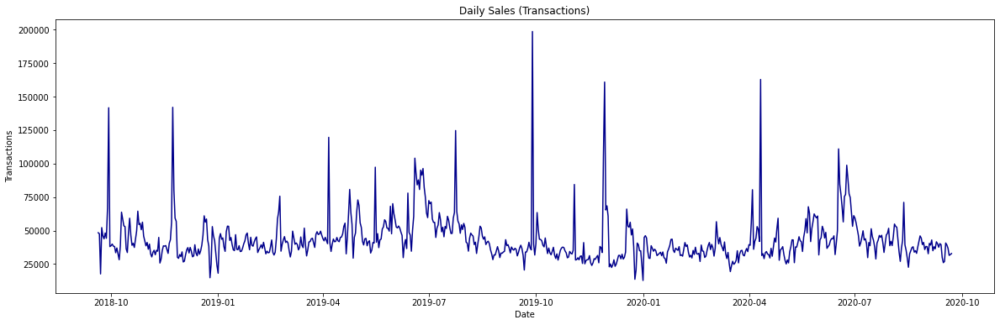
<br><br>

### Distribution of number of Transactions per day grouped by Sales Channel:

- Sales Channel 1 has faily consistent number of transactions per day with rarely any large spikes.
- Sales Channel 2 consistently outperforms Sales Channel 1 throughout 2018 to 2020.
- The quarterly seasonal spike of tranactions is caused by transactions through Sales Channel 2.

<br><br>
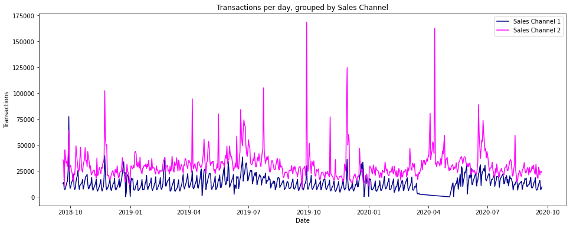
<br><br>

### Distribution of number of unique Articles sold per day grouped by Sales Channel:

- Sales Channel 1 has faily consistent number of unique Articles sold per day with rarely any spikes.
- Sales Channel 2 consistently sells more unique products per day than Sales Channel 1 throughout 2018 to 2020.

<br><br>
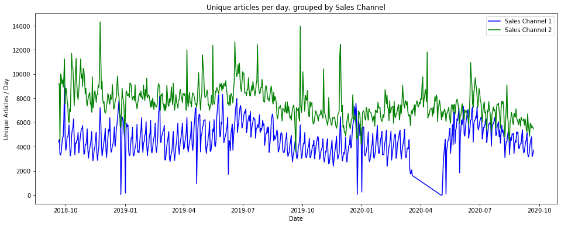
<br><br>

After seeing the distrubtion of transactions and unique articles sold per day, we get the intuition that Sales Channel 1 customers are more consistent and conservative buyers.

On the other hand, customers that use Sales Channel 2 are ready to try out new products and also purchase products only in specific months during the year.

### Distribution of Customers across Age Group:

- The highest number of customers are aged 21 years.
- A large proportion of the customer demographic are young adults aged 19 to 26.
- There is also a significant customer base that is aged 46 to 56 years.

<br><br>
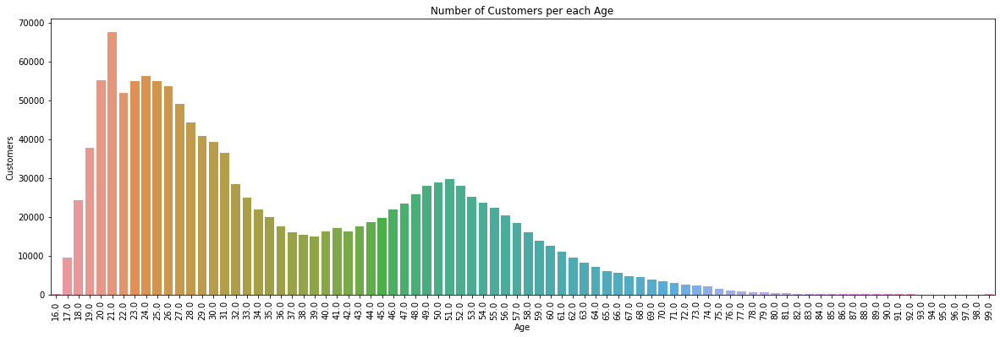
<br><br>

### Distribution of Customers who have subscribed for Fashion News Alerts:

- 67% of all the customers have not subscribed for Fashion News Alerts.
- 32% of the customers have subscribed for regular updates.
- 1% of the customers have subscribed for monthly updates

<br><br>
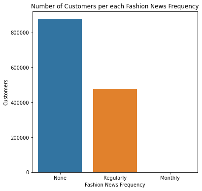
<br><br>

### Product Groups with the highest number of Product Types:

The product group 'Accessories' has the highest number of product types followed by 'Shoes' and 'Upper Body Garments'.

<br><br>
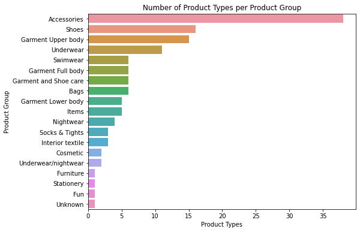
<br><br>

### Product Types with the highest number of unique articles:

The product type 'Trousers' has the highest number of unique articles closely followed by 'Dress'.

<br>
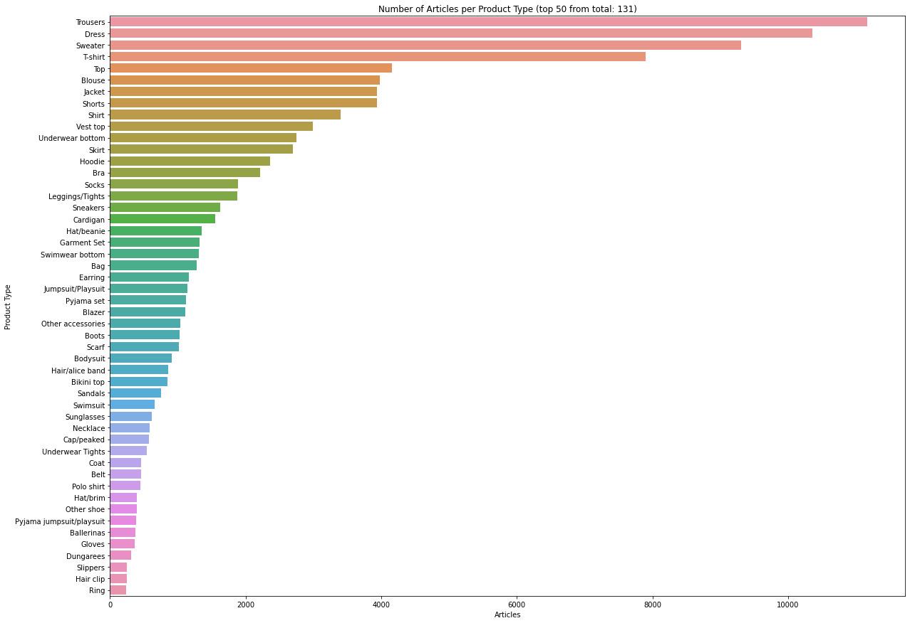
<br>

### Product Departments with the highest number of unique articles:

The product type 'Jersey' has the highest number of unique articles closely followed by 'Knitwear'.

<br>
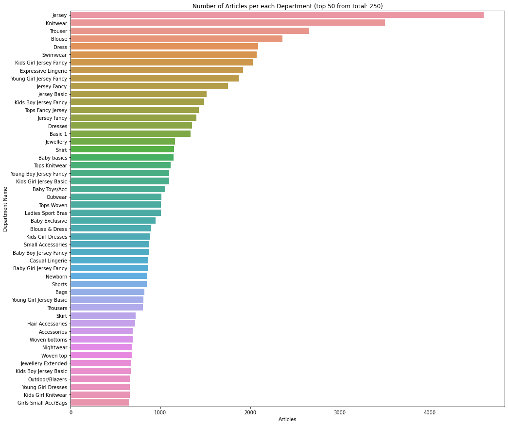
<br>

### Product Graphical Appearance Names with the highest number of unique articles:

The highest number of articles are of 'Solid' appearance followed by 'All over pattern'.

<br>
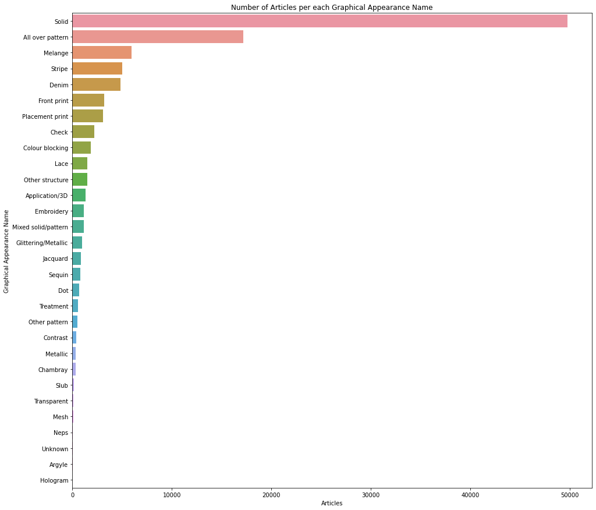
<br>

### Product Index with the highest number of unique articles:

The index named 'Ladiesear' has the highest number of unique articles closely followed by 'Divided'.

<br>
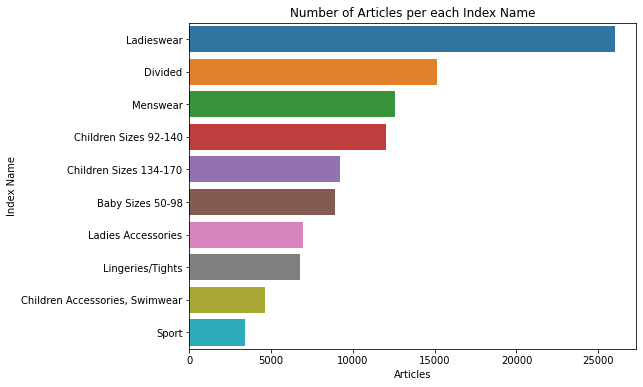
<br>

### Product Colour Group Names with the highest number of unique articles:

The highest number of articles are of 'Black' colour group followed by 'Dark Blue' and 'White'.

<br>
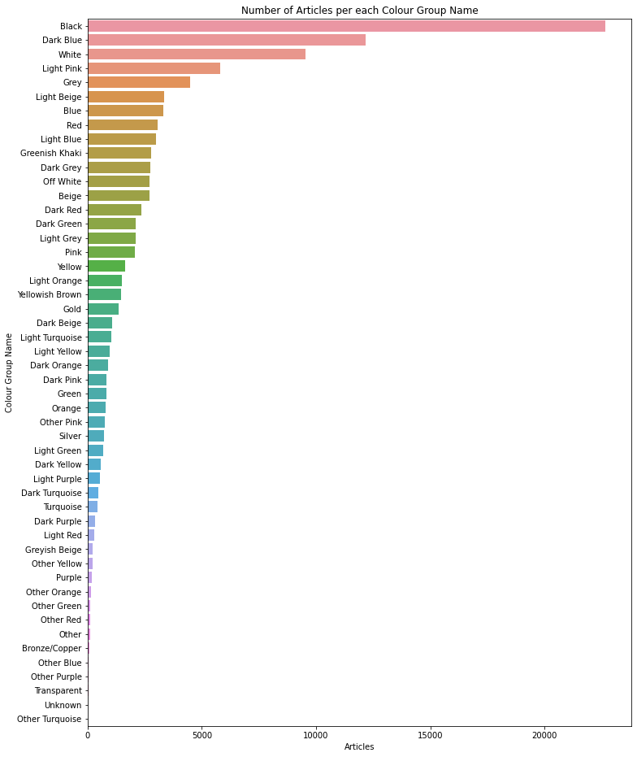
<br>

## Experiments:

Intuition behind custom retrieval strategy can be found [here.](https://nbviewer.org/github/awinml/hm-recsys/blob/main/hm-similar-items-explore.ipynb)

### Candidate Retrieval

A lightweight candidate retrieval method was created that was a combination of the following retrieval strategies.

- Recommend Items Purchased Together in the last week:

  - Get 5 pairs of each article that were sold in the past week.
  - Ignore any article that wasn't sold within the past week.
  - Ignored any pair purchased by less than 2 customers.

- Recommend Items Purchased Together in the last few weeks:

  - The number of previous weeks was tuned.

- Recommend most popular items based on age group

This is a manual, time-aware collaborative filtering method so it includes trend information as well.

### Candidate Ranking:

Feature creation for ranking based on:

- Percentage of customers the pair was based on.
- How recently the article was purchased.
- Number of times the pair of products was purchased.

A LightGBM ranking model was used to rank the candidates.

- Hyperparameters of the LightGBM model such as `n_estimators`, and `num_leaves` were tuned.

## Results:

The fine tuned recommendation system using the custom candidate retrival method and LightGBM Ranking model was used to make final predictions which yielded an **MAP@12 score of 0.345 and a overall AUC of 0.76.**

## Run Locally

The code to run the project can be found here: [H&M Personalized Product Recommendations Github](https://github.com/awinml/hm-recsys).

1. Install required libraries:
   ```bash
     pip install -r requirements.txt
   ```
2. Generate local cv:
   ```bash
     python hm-cv.py
   ```
3. Fine-tune models and generate predictions:
   ```bash
     python hm-custom-retrieval-pred.py.py
   ```

## License &nbsp;&nbsp; [](https://choosealicense.com/licenses/mit/)

Author: [@awinml](https://www.github.com/awinml)

## Feedback

If you have any feedback, please reach out to me at: &nbsp; &nbsp;
<a href="https://www.linkedin.com/in/ashwin-mathur-ds/"></a>
